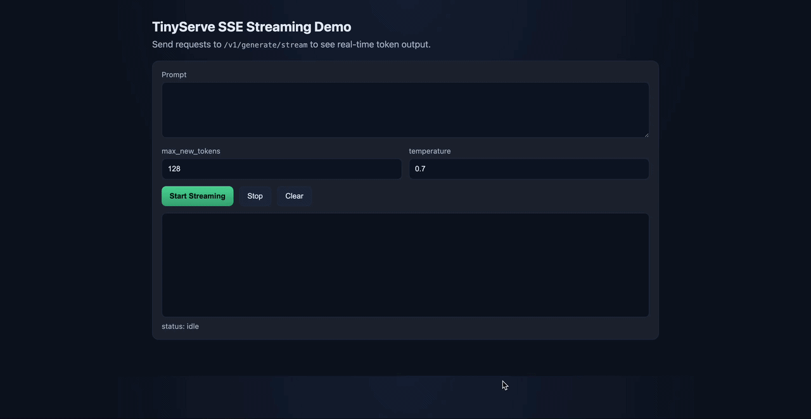
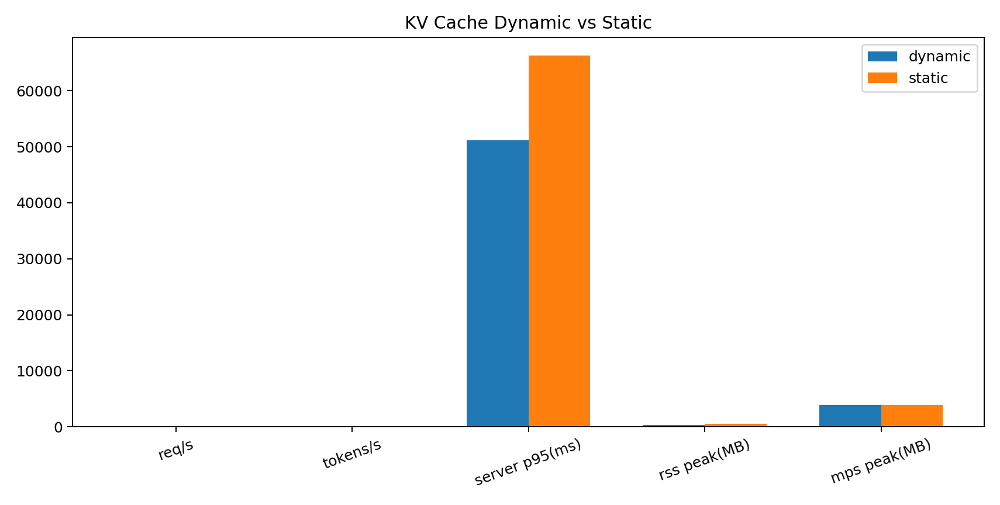
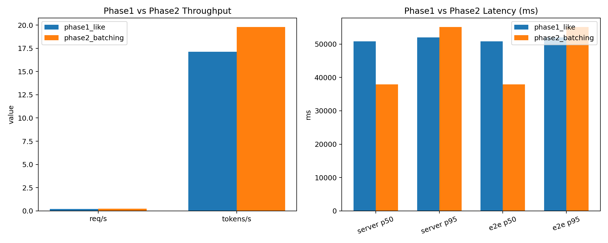

# TinyServe: Final Phase 

This is the Final Phase implementation of TinyServe:

- FastAPI endpoint for text generation
- Requests are enqueued into an `asyncio.Queue`
- A background scheduler builds dynamic batches and runs one batched inference
- Each request gets its own response via `asyncio.Future`
- SSE streaming endpoint for single-request token streaming
- KV-cache optimization (dynamic/static)

## 1) Streaming Inference Demo

TinyServe supports real-time token streaming via Server-Sent Events (SSE)

<p align="center">
  
</p>

## 2) 📊 Benchmark testing results

### 🔹 KV-Cache Benchmark: Dynamic vs Static


### 🔹 Scheduling Benchmark: Single Request vs Batched


## 3) Environment

```bash
python3 -m venv .venv
source .venv/bin/activate
pip install -r requirements.txt
```

## 4) Choose model

Default model:

```bash
export TINYSERVE_MODEL_ID="Qwen/Qwen3-1.7B"
```

Optional input guardrail:

```bash
export TINYSERVE_MAX_INPUT_CHARS=12000
```

Batch scheduler controls:

```bash
export TINYSERVE_MAX_BATCH_SIZE=4
export TINYSERVE_MAX_BATCH_WAIT_MS=50
export TINYSERVE_QUEUE_MAX_SIZE=256
```

KV-cache strategy:

```bash
export TINYSERVE_CACHE_IMPLEMENTATION=dynamic   # dynamic | static
```

## 5) Run server

```bash
uvicorn tinyserve.main:app --host 0.0.0.0 --port 8000 --app-dir src
```

## 6) Test

Health check:

```bash
curl http://localhost:8000/health
```

Generation:

```bash
curl -X POST http://localhost:8000/v1/generate \
  -H "Content-Type: application/json" \
  -d '{
    "prompt": "Explain what dynamic batching is in simple terms.",
    "max_new_tokens": 128,
    "do_sample": true,
    "temperature": 0.7,
    "top_p": 0.8,
    "enable_thinking": false
  }'
```

Streaming generation (SSE):

```bash
curl -N -X POST http://localhost:8000/v1/generate/stream \
  -H "Content-Type: application/json" \
  -d '{
    "prompt": "Explain dynamic batching with a short analogy.",
    "max_new_tokens": 96,
    "do_sample": false,
    "enable_thinking": false
  }'
```

Lightweight browser demo:

- Open `http://localhost:8000/`
- Click `Start Streaming`
- You should see token text appear incrementally

## Notes

- First startup will download model weights from Hugging Face and can take time.
- For consistent latency/throughput baseline, keep `enable_thinking=false`.
- On Apple Silicon, the service uses `mps` if available.
- `/health` now includes queue and scheduler status fields.
- `/health` also includes cache strategy and process memory snapshots.
- Streaming route is implemented as a simple single-request mode on the shared model lock.

## 7) Load testing

```bash
python testing/load_test.py --total 60 --concurrency 10 --label phase2_batching
```

More examples:

- `testing/README.md`

## 8) KV-cache optimization benchmark

Use the same load profile for all modes, restart server between runs:

```bash
# dynamic
export TINYSERVE_CACHE_IMPLEMENTATION=dynamic
python testing/load_test.py --label cache_dynamic --output-json testing/report_cache_dynamic.json

# static
export TINYSERVE_CACHE_IMPLEMENTATION=static
python testing/load_test.py --label cache_static --output-json testing/report_cache_static.json
```

Compare:

- `tokens_per_s` (throughput)
- `server_latency_ms_p95` (tail latency)
- `process_rss_mb_peak` and `mps_allocated_mb_peak` (memory)
